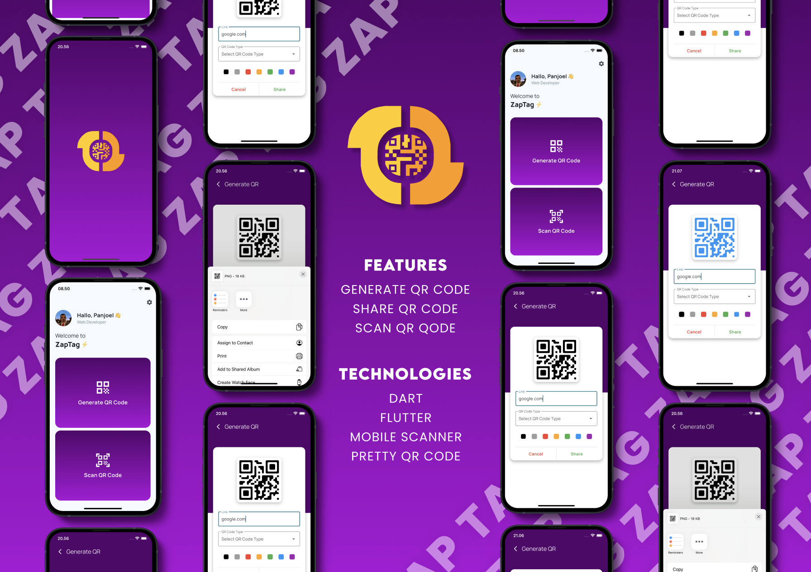

# ⚡ ZapTag - QR Code App  

Welcome to **ZapTag**, your all-in-one QR code solution built using Flutter! 🎉  
Whether you’re creating, scanning, or sharing QR codes, ZapTag makes it easy, fast, and fun. Add a personal touch with custom colors, save QR codes, and more—all from one sleek app!  

---

## 📋 What's Inside?  

Here’s why you’ll love **ZapTag**:  

- **🎨 Custom QR Code Generation:**  
  Create beautiful QR codes with the ability to customize colors to match your style.  

- **📷 Scan Any QR Code:**  
  Quickly scan QR codes with high accuracy using our advanced scanner.  

- **🤝 Share QR Codes Seamlessly:**  
  Share your generated QR codes effortlessly through social media or messaging apps.  

- **🌈 Change QR Code Colors:**  
  Personalize the look of your QR codes with gradient color options.  

- **📸 Screenshot Your QR Codes:**  
  Save your QR codes directly to your gallery with the built-in screenshot feature.  

---

## 🎯 Why ZapTag?  

Because QR codes are everywhere, and you need a tool that’s powerful, customizable, and easy to use. Whether you're using it for business, personal branding, or just for fun, ZapTag has got you covered.  

---

## 🚀 Technologies Used  

ZapTag is powered by cutting-edge technologies to deliver the best experience:  

- **Built with:**  
  - Dart & Flutter  

- **Dependencies:**  
  - [`pretty_qr_code`](https://pub.dev/packages/pretty_qr_code) - For crafting stunning QR codes.  
  - [`mobile_scanner`](https://pub.dev/packages/mobile_scanner) - High-performance QR code scanner.  
  - [`share_plus`](https://pub.dev/packages/share_plus) - Easy QR code sharing.  
  - [`permission_handler`](https://pub.dev/packages/permission_handler) - Smooth permission handling.  
  - [`screenshot`](https://pub.dev/packages/screenshot) - Save QR codes as images.  

---

## 📸 Screenshots  

Here’s a sneak peek at what you can expect:  

  
